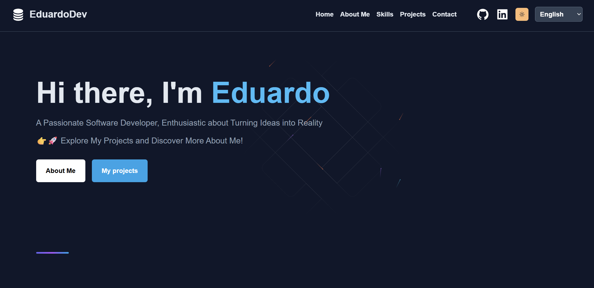

# My Portfolio

# Description  
Personal web portfolio showcasing my skills, projects, and contact information. It features a responsive design, dark/light theme toggle, multi-language and dynamic project listing. Hosted on Netlify.

## Live Demo:  
[Live Demo Link](https://eburzlaff.netlify.app/)

## Technologies  
- ReactJS  
- Tailwind CSS  
- ViteJS
- React Icons
- i18next (for language support)  

## Screenshots  

  
    

  

## Setup  
- Download or clone the repository  
- Run `npm install`  
- Run `npm run dev`
